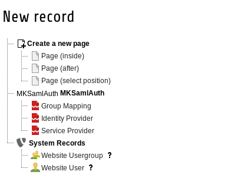

# Administration Guide

# Installation

We recommend composer to install this extension. The extension installer isn't offical supported.

```
$ composer require dmk/mksamlauth
```

Then navigate in your TYPO3 Backend to the extension list and
active the extension.

## Preparations
In order to active this extension you first need to generate an SSL Certificate with the correspending key:

This can be easily archived through the `openssl` library:

```bash
$ openssl req -new -x509 -days 365 -nodes -sha256 -out saml.crt -keyout saml.pem
```

This will generate you two files. `saml.crt` is the certificate and `saml.pem` is the key file. 

The next step is to generate the Metadata information for
the identity provider. This can be archived through this tool:

https://www.samltool.com/sp_metadata.php

:warning: Attention :warning: : You have to set your entrypoint as entity id. This is a known limitation from this library and TYPO3.

Upload this XML in your Identity Provider. 

## Setup

You have to create a configuration record through the TYPO3 Backend. Navigate to your page or sys_folder and add a new "Identity Provider" record. 



Then fill out the page and save it. Done!

This was easy right?